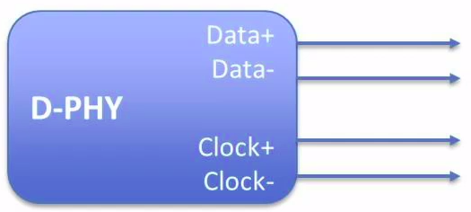
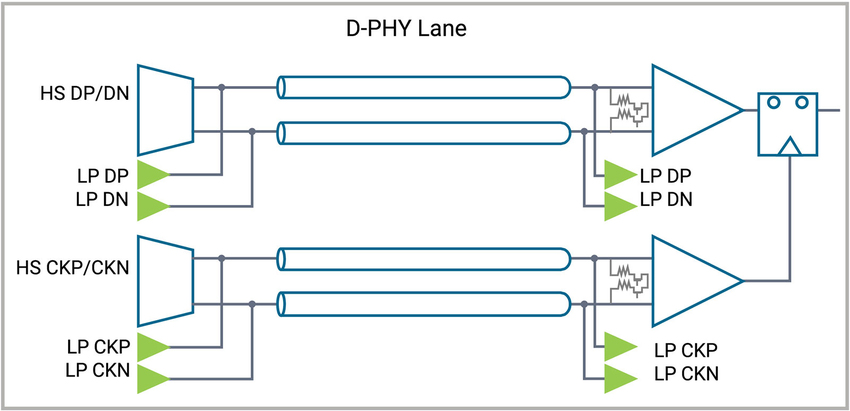
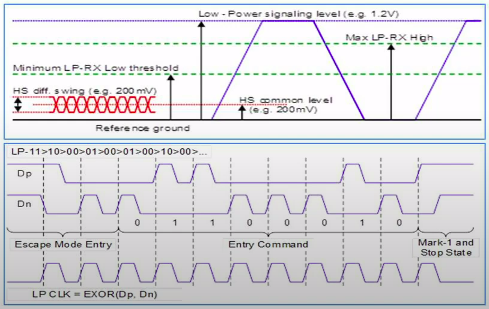
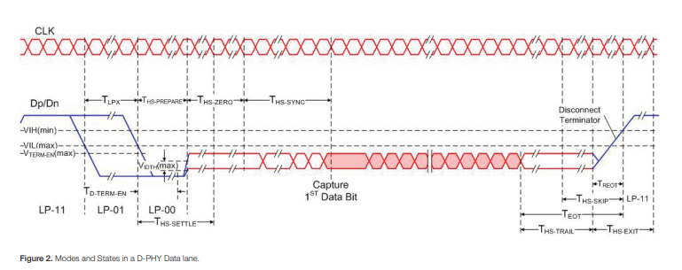
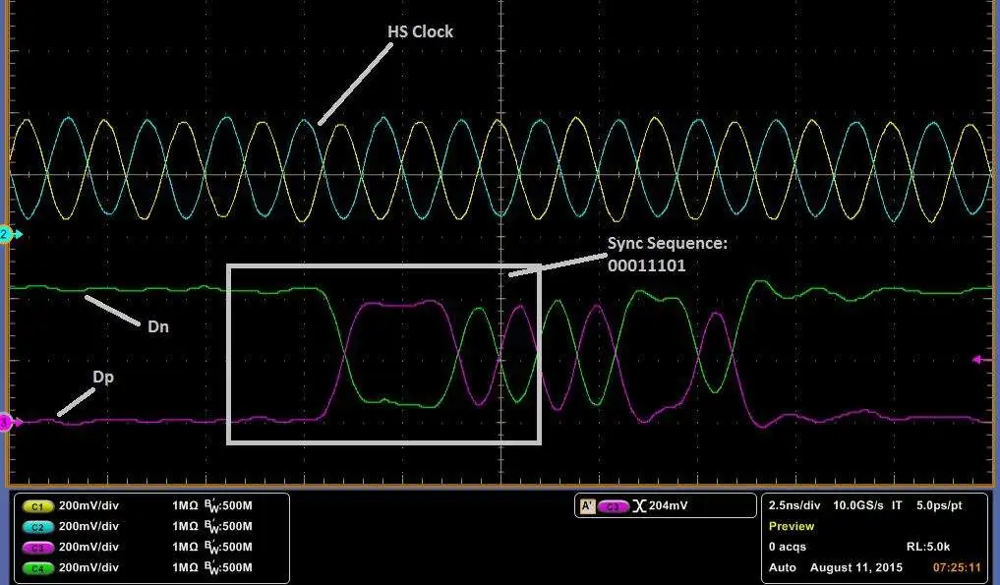

# D-PHY

参考链接：

- [MIPI DevCon 2016 - MIPI D-PHY℠: Physical Layer Test & Measurement Challenges](https://www.youtube.com/watch?v=1re5XdFkV30) 
- [MIPI信号的分析--结合示波器实际测试波形](https://blog.csdn.net/lanxiaoke123/article/details/98349780)
- [Meeting Fundamental Interface Requirements For Camera And Display With Integrated MIPI IP](https://semiengineering.com/meeting-fundamental-interface-requirements-for-camera-and-display-with-integrated-mipi-ip/)
- [All you need to know about MIPI D’PHY RX](https://www.edn.com/all-you-need-to-know-about-mipi-dphy-rx/)
- 

D-PHY最少有四条线：一组Data Lane + 一组Clock Lane (最多四组Data Lane)

如下图所示： 

D-PHY有两种操作模式：HS(High Speed Mode)、LP(Low Power Mode)

- HS 高速传输模式
  - terminated（终端化消除信号反射干扰失真问题）
  - 低摆幅（200mV）、差分信号、小于10Mbps
  - NRZ(Non-Return-to-Zero)编码，相邻位没有过渡电平
  - 用于数据传输
- LP低功耗控制模式
  - Non-Terminated
  - 单端信号传输(1.2V)
  - spaced-one-hot编码，区分通道，减少误码
  - 用于控制信号

下图展示了Date Lane的框图，可以看出terminated与non-terminated的区别

 

下图展示了DP/DN在不同模式下的电压差异以及在LP模式下典型的波形。

 

如上图所示，是一个典型的LP模与HS模式切换的波形变化：

- LP->HS:  
  - LP11-LP01-LP00-HS0-SOT(0001_1101)
  - HS0+SOT波形
  - HS0:确保正式传输前接收器正常可用
  - SOT：sync sequence接收到之后，高速接收器模块将启用其终端接收高速差分信号
- HS->LP:EoT-LP11

典型的整个过程如下图所示

 

每次HS burst之后，Data Lane都会进入LP11状态。单个HS脉冲串表示与图像一条水平线相对应的图像数据。HS脉冲串之间的LP11状态表示blanking阶段。HS与LP模式的结合来降低总体功耗。

